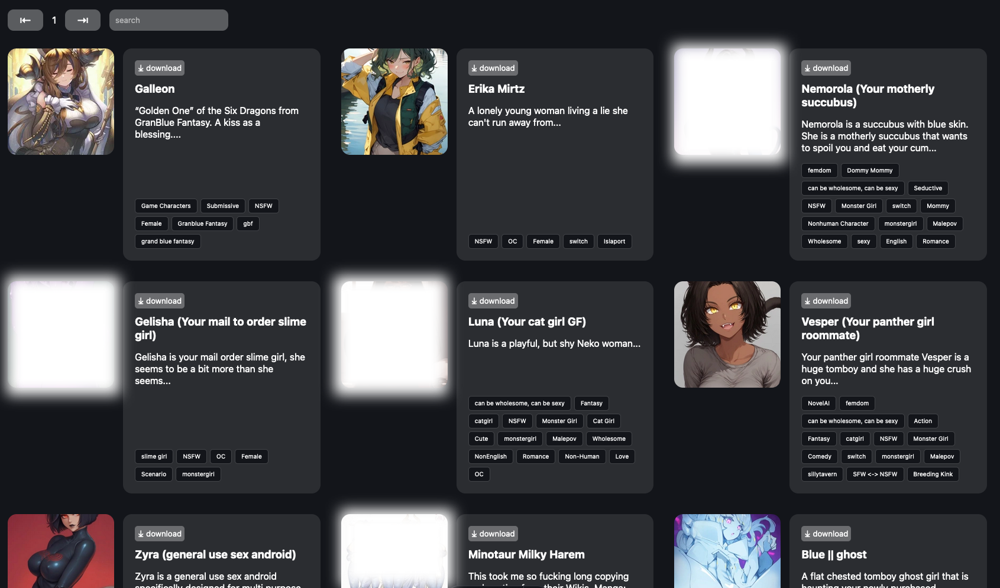

# chubster

simple chub UI that doesnt take 30 seconds to load and has no bloat

if you want to build: `npm run build` then put the `dist` folder onto your server and run the standalone server to handle it all, see: https://docs.astro.build/en/guides/integrations-guide/node/#standalone

otherwise during development or quick testing: `npm run dev` (make sure to install dependencies with `npm install` first)

by default it'll build the node astro server; you can refer to other ssr-adapters other than nodejs here: https://docs.astro.build/en/guides/server-side-rendering/

copy .env.example to .env and adjust config.

config:
- PUBLIC_BAN_AUTHORS - set it to "1" if you want to be able to ignore card creators on your instance (not recommended for public instances)
- PUBLIC_FUZZY_FILTERED_TAGS - fuzzy matches tags, so e.g. "male" will also filter "malepov"
- PUBLIC_EXACT_FILTERED_TAGS - exact matches, so "male" will only filter "male"

preview below is censored for github, but there's none present in the actual ui

